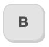
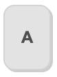
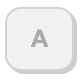

# react-key-icons

> Small React component used to present keyboard keys or key combinations.

## Installation

NPM:

```Shell
npm install react-key-icons
```

Yarn

```Shell
yarn add react-key-icons
```

## Usage

The React component has one required prop, `value`, and the remaining are optional styling-related props.

```TypeScript
import Key from "react-key-icons";

const Component = () => {
  return (
    <Key value={"B"} />
  );
};
```

### Props

| Name | Purpose | Required? |
| ---- | ------- | --------- |
| `value` | String displayed on the button. | Yes |
| `height` | Set the height of the button. | No |
| `disabled` | If present, the button will appear shaded out. | No |
| `showCursor` | By default, the cursor is not shown when hovering over the button. If this prop is present, the cursor is shown instead. | No |

## Examples

### Standard

```TypeScript
const Component = () => {
  return (
    <Key value={"B"} />
  );
};
```



### Height

```TypeScript
const Component = () => {
  return (
    <Key value={"A"} height={96} />
  );
};
```



### Disabled

```TypeScript
const Component = () => {
  return (
    <Key value={"A"} disabled />
  );
};
```


